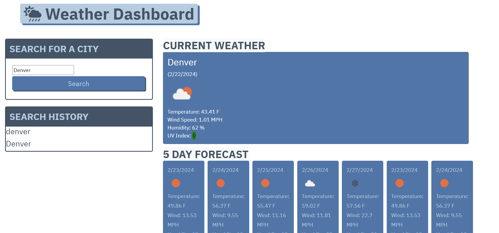

# weather-dashboard
by Samira Chetta

## Description
This application allows users to search any city and view a 5-day weather forecast for that city.

## Technologies
This application utilizies the OpenWeatherMap API as well as HTML, CSS, Bootstrap, JSON, and JavaScript.

## Usage
Enter a city into the search bar. Each search will be saved on the left side on the screen in the search history.

## Deployed Application
This application is deployed at https://samirayc.github.io/weather-dashboard/
